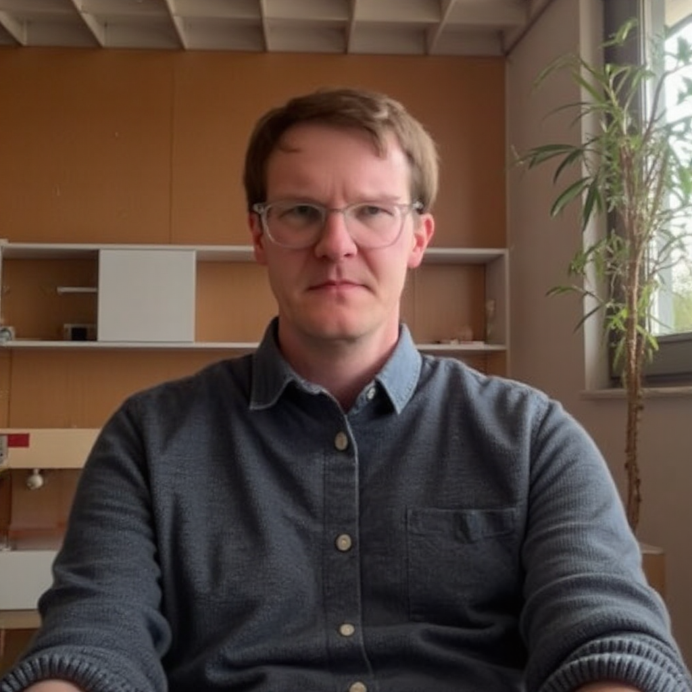
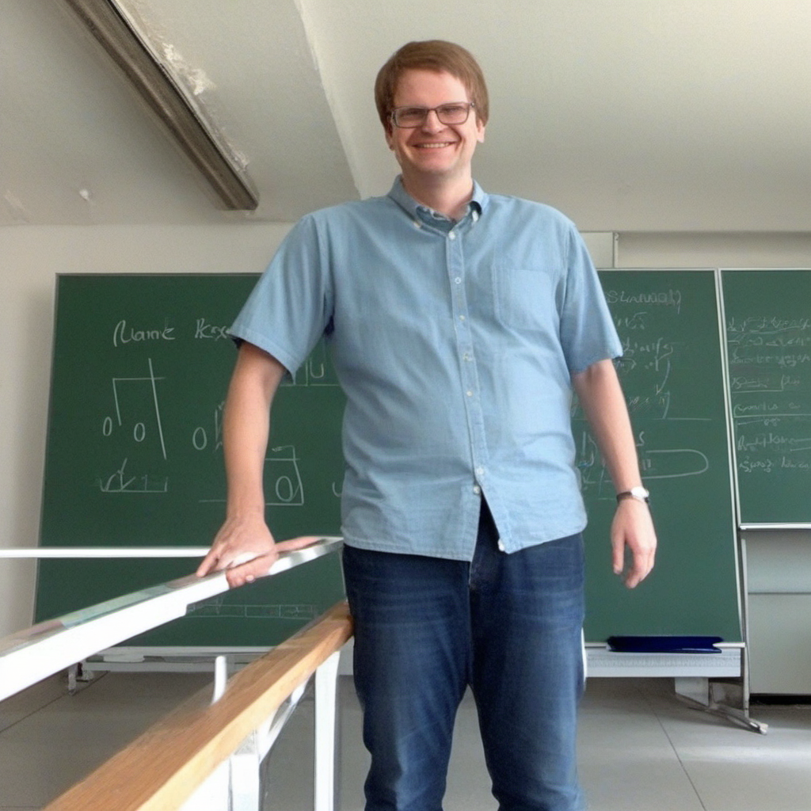

# Sample Results

Example images generated with the workflows and models from this project.

---

## Flux 1.dev Results

Images generated using the Flux 1.dev fp8 model with the standard image generation workflow.

### Sample 1

*Generated with Flux 1.dev fp8*

---

### Sample 2

*Generated with Flux 1.dev fp8*

---

### Sample 3

*Generated with Flux 1.dev fp8*

---

## SDXL 1.0 Results

Images generated using Stable Diffusion XL 1.0 with base and refiner models.

### Sample 1

*Generated with SDXL 1.0 Base + Refiner*

---

### Sample 2

*Generated with SDXL 1.0 Base + Refiner*

---

## Try It Yourself

All LoRA workflows used to generate personalized images are included in the repository:

| Model | Workflow File |
|-------|--------------|
| Flux 1.dev LoRA | `Workflows/LoRAImageGeneration/Flux1LoRAImageGeneration.json` |
| SDXL 1.0 LoRA | `Workflows/LoRAImageGeneration/SDXL1LoRAImageGeneration.json` |

See the **[Workflows Guide](workflows.md)** for setup instructions.

---

## Custom Results with LoRA

Want to generate personalized images? Train your own LoRA model following the **[LoRA Training Guide](lora.md)**.

Pre-trained LoRA models are included in the repository:
- `LoRA_Models/UweHahneSDXL_v1.safetensors` — SDXL 1.0 LoRA
- `LoRA_Models/UweHahneFlux1_v1.safetensors` — Flux 1.dev LoRA

---

## Next Steps

- **[Installation →](installation.md)** — Set up ComfyUI
- **[Workflows →](workflows.md)** — Load and use the workflows
- **[LoRA Training →](lora.md)** — Train custom models
